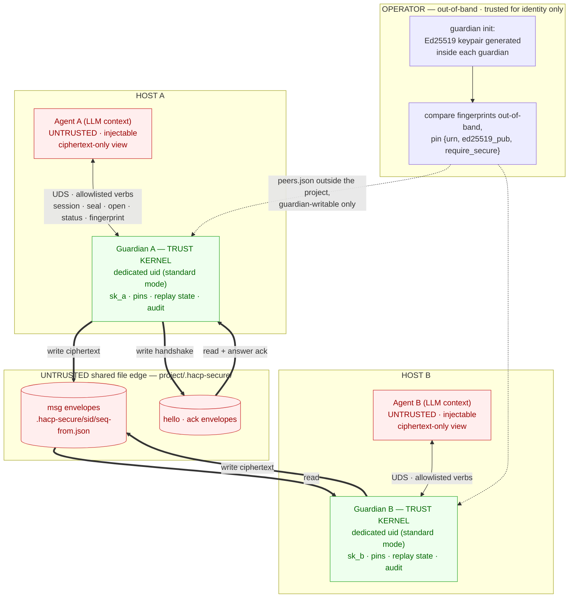
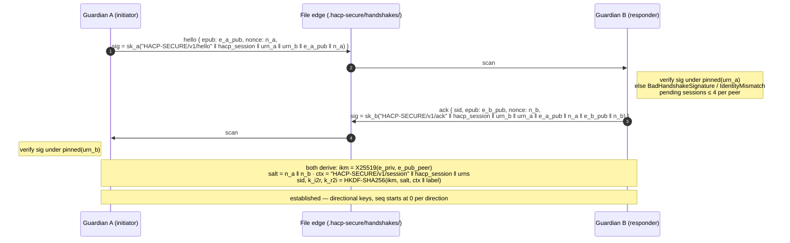
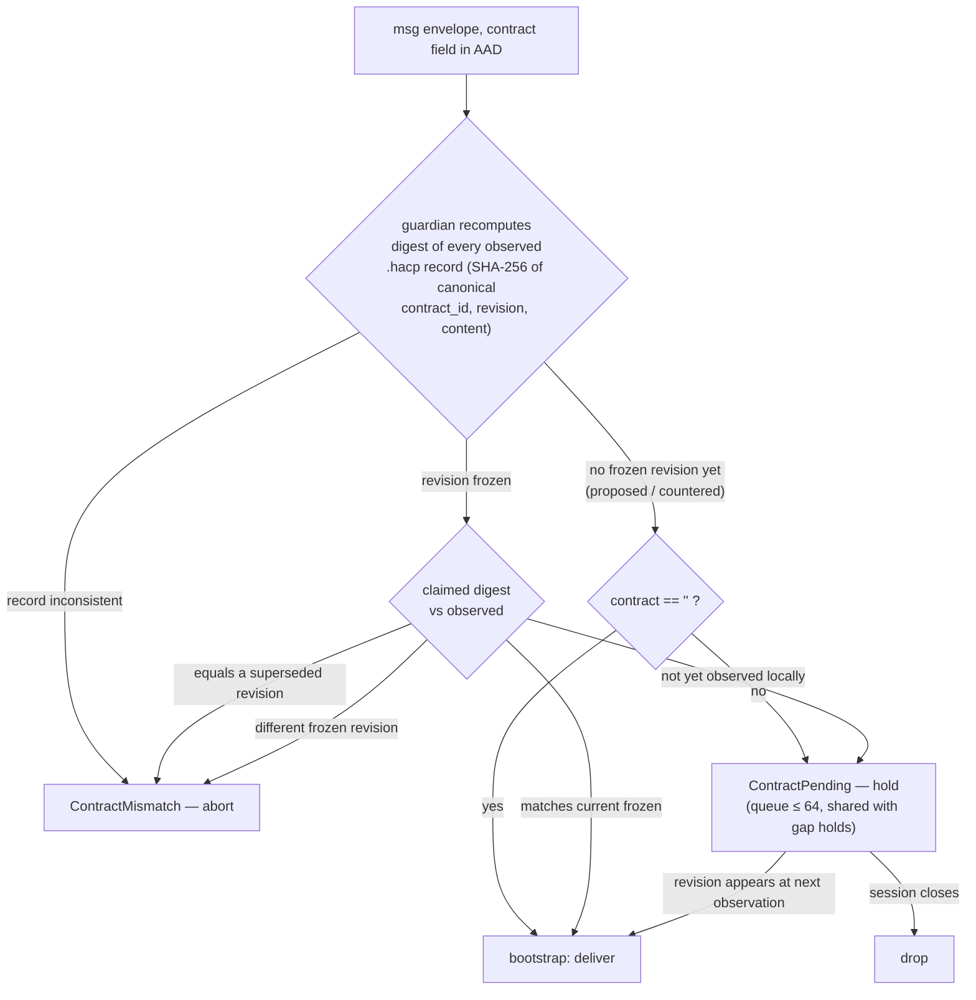
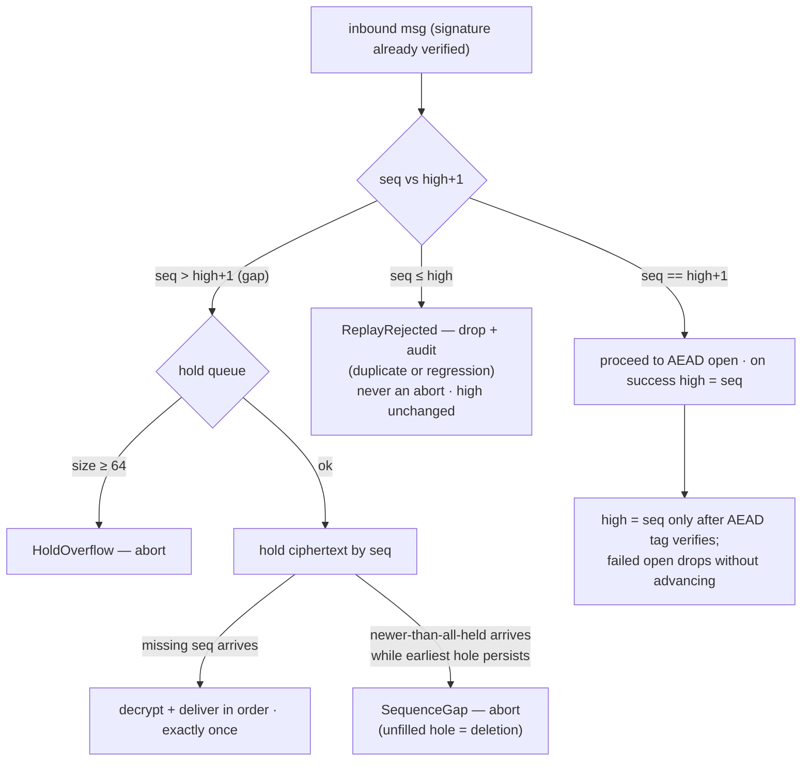
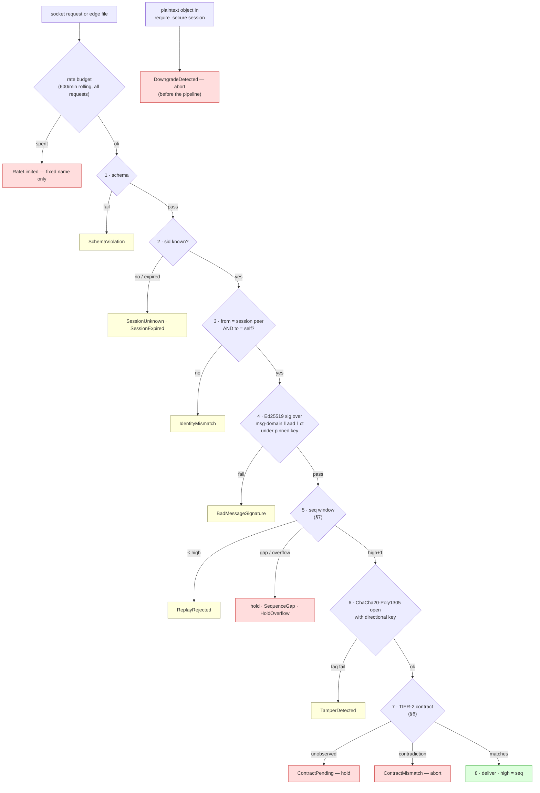
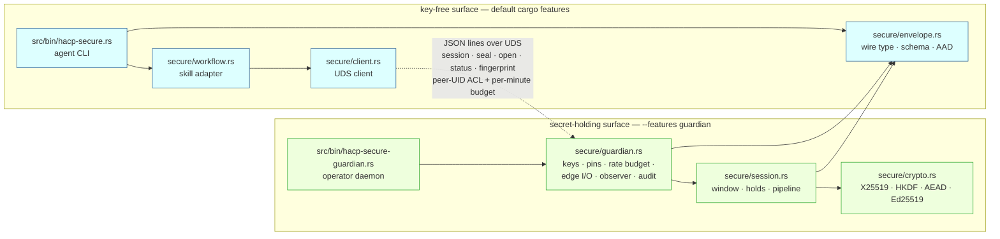

# HACP Secure

Optional payload-protection layer for HACP: guardian-held keys, authenticated
identities, encrypted messages, replay protection. Primitives: X25519
(RFC 7748) · HKDF-SHA256 (RFC 5869) · ChaCha20-Poly1305 (RFC 8439) · Ed25519
(RFC 8032). Wire schema: `spec/schemas/secure-envelope.json` (frozen).
Setup and merge impact: `docs/hacp-secure-integration.md`. Demos:
`docs/hacp-secure-demos.md`.

## 1. Design rule and adversary

HACP Secure does **not** modify HACP (frozen 1.1 + 2.0 draft). A payload that
must be protected is replaced by a `SecureEnvelope` before it touches the
shared file edge.

The adversary is a **prompt-injected or compromised agent reasoning loop**
with arbitrary tool calls and arbitrary writes into the shared project
directory, running as the **same OS uid** as its guardian. Guardian-uid or
root compromise is out of scope (trust kernel). The LLM context is always
untrusted: everything an agent can see is public and injectable.

| Mode | Key protection | Status |
|---|---|---|
| **Standard** | Guardian under a dedicated OS uid; 0600 keyfile, 0700 socket. Agent uid may *connect*, never *read*. Falsifiable: `sudo -u agent cat <keyfile>` fails | Specified |
| **Degraded** | Same-uid guardian. Reduces to **context hygiene**: no agent-reachable tool returns, accepts, or logs key material | Residual risk, labeled at startup |

## 2. Actors and trust boundaries

| Actor | Sees keys? | Trusted for |
|---|---|---|
| Agent (LLM context) | **Never** — ciphertext only | Choosing to protect a payload |
| Guardian (per agent) | **Yes** — sole key holder | All crypto: handshake, seal, open, sign |
| File edge (`.hacp-secure/`) | No | Best-effort, at-least-once delivery |
| Operator | Yes, at provisioning | Identity provisioning; not content |



Attacker view of the edge (all mitigated, §12): an **observer** reads
ciphertext only · a **writer/injector** fails signature or tag · a
**replayer** hits the seq window (state is guardian-memory-only, so edge
tampering cannot roll it back) · **deletion** becomes a loud `SequenceGap`
abort · **stripping crypto** under `require_secure` is a `DowngradeDetected`
abort. No keys, pins, or counters ever persist on the edge.

In degraded mode the uid wall around each guardian is absent — protection
reduces to context hygiene, and the guardian labels it at startup.

Boundary rules: (1) everything in an LLM context is public — the agent-facing
surface contains no key material, so no tool call can *return* a secret;
(2) the project directory is hostile — only ciphertext crosses it, integrity
comes from signatures/AEAD, never file permissions, and nothing inside it can
change identity trust; (3) the guardian's uid is the kernel (absent in
degraded mode — startup says so); (4) the operator is trusted for identity,
not content; (5) failure is closed — named errors, no plaintext fallback.

## 3. Identity

- Identity is the URN. Ed25519 keypairs are generated *inside* the guardian
  (`init`); no export command exists.
- Peer keys are **pinned** in guardian-private `peers.json` outside the
  project: `{urn, ed25519_pub, require_secure}`, exchanged out-of-band with
  fingerprint confirmation. Nothing in `.hacp/` can change a pin or policy.
- A sender is authenticated iff its handshake signature verifies under the
  pinned key for the claimed URN; missing pin or mismatch is
  `IdentityMismatch` (fail closed).
- No certificates, rotation, or revocation; a key is replaced by operator
  re-provisioning.

## 4. Handshake and key schedule

One round trip, **signed ephemeral X25519**; identity keys never perform DH.
`hacp_session` is bound into every transcript.

```
A → B  hello { v:1, kind, from, to, epub:e_a_pub, nonce:n_a,
        sig = sk_a("HACP-SECURE/v1/hello" ‖ hacp_session ‖ urn_a ‖ urn_b ‖ e_a_pub ‖ n_a) }
B: verify under pinned(urn_a)               → else BadHandshakeSignature/IdentityMismatch
B → A  ack   { …, sid, epub:e_b_pub, nonce:n_b,
        sig = sk_b("HACP-SECURE/v1/ack" ‖ hacp_session ‖ urn_b ‖ urn_a ‖ e_a_pub ‖ n_a ‖ e_b_pub ‖ n_b) }
A: verify under pinned(urn_b)               → else BadHandshakeSignature/IdentityMismatch

ikm   = X25519(e_priv, e_pub_peer)
salt  = n_a ‖ n_b
ctx   = "HACP-SECURE/v1/session" ‖ hacp_session ‖ urn_initiator ‖ urn_responder
sid   = HKDF-SHA256(ikm, salt, ctx‖"sid",   16)
k_i2r = HKDF-SHA256(ikm, salt, ctx‖"k_i2r", 32)     # initiator→responder
k_r2i = HKDF-SHA256(ikm, salt, ctx‖"k_r2i", 32)     # responder→initiator
```

Mutual authentication (signatures cover both ephemerals, both nonces, URNs,
and the session id — no swap or cross-session reuse without breaking one) and
forward secrecy (ephemeral DH only). Replayed/flooded hellos are bounded:
**at most 4 pending sessions per peer** (oldest evicted); an evicted hello
fails at the first `msg` and must re-run.



## 5. SecureEnvelope

JSON, canonical per HACP v2 rules; the canonical header (minus `ct`/`sig`) is
the AAD.

| Field | Present | Meaning |
|---|---|---|
| `v` = 1 | always | version |
| `kind` = hello\|ack\|msg | always | envelope kind |
| `from`, `to` | always | URNs |
| `contract` | always | frozen revision digest (`sha256:<64hex>`) or `""` for bootstrap |
| `sid` | ack, msg | session id |
| `seq` | msg | per-direction counter; also the AEAD nonce input |
| `epub`, `nonce` | hello, ack | ephemeral X25519 pub, handshake nonce |
| `sig` | all | Ed25519 signature |
| `ct` | msg | ChaCha20-Poly1305 ciphertext ‖ 16-byte tag |
| `ts` | optional | advisory only; never an auth input |

Encrypt-then-sign with domain separation:

```
aad     = canonical_json(envelope minus ct, sig)
nonce96 = 0x00000000 ‖ u64be(seq)
ct      = ChaCha20-Poly1305(k_dir, nonce96, aad, plaintext)
sig     = Ed25519(sk_sender, "HACP-SECURE/v1/msg" ‖ aad ‖ ct)
```

No prefix-less signing input exists, and the guardian API has no raw
`sign(bytes)` — an injected agent cannot make the identity key sign chosen
content. The required per-message signature gives third-party attributability
(any holder of the pinned public key can attribute an envelope without AEAD
keys; non-repudiation is in scope). Envelopes are written to
`.hacp-secure/<sid>/<seq>-<from>.json`.

## 6. Two-tier contract binding

- **TIER-1 (always)**: the HACP session is bound via the transcript, HKDF
  `ctx`, and `sid` (in the AAD). Cross-session replay fails the tag.
- **TIER-2 (frozen contracts)**: envelopes sent while the contract is frozen
  carry `contract = <revision digest>` in the AAD; bootstrap traffic carries
  `""` (the digest cannot exist before the revision does).

| Receiver observation | Action |
|---|---|
| Digest matches observed frozen revision | deliver |
| Not yet observed | **HOLD** (`ContractPending`) in the bounded queue; re-evaluated per observation; dropped at close |
| Contradicts a different observed revision | `ContractMismatch` → hard abort |



Trust source, honestly: the guardian observes "frozen revision" in `.hacp/`,
which a same-uid agent can rewrite. It recomputes every digest as SHA-256
over canonical `{contract_id, revision, content}` before trusting a record,
but TIER-2 proves only an **attributable signed claim of revision D**, not
bilateral consent. Control-plane authenticity is a non-goal (NG-5).

## 7. Replay protection

- The replay counter **is** the AEAD nonce; directional keys rule out
  cross-direction collision; reuse is detectable by construction.
- Replay state lives **only in guardian memory**: a restart voids all sessions
  (`SessionExpired`); there are no persisted counters to roll back.
- Per direction, `high` = highest accepted seq:
  - `seq == high+1` → accept.
  - `seq <= high` → `ReplayRejected`: drop and audit (`duplicate` vs
    `regression`), never an abort; delivery stays exactly-once.
  - `seq > high+1` → hold in the bounded queue (shared with contract holds,
    capacity 64) and drain in order. `SequenceGap` hard-aborts on queue
    overflow (`HoldOverflow`) or newer traffic while the earliest hole
    persists — an unfilled hole means deletion, a visible abort not a silent
    stall.
- `seq == u64::MAX` → `SessionExhausted`; only a new handshake recovers.
- `sid`, `from`, `to`, `contract` are in the AAD ⇒ splices fail the tag.



## 8. Verification pipeline and errors

Normative order; the first failing step names the error. `high` advances only
after step 7.

```
1. JSON schema          → SchemaViolation
2. sid lookup           → SessionUnknown / SessionExpired
3. route check          → IdentityMismatch   (from ≠ session peer OR to ≠ self)
4. Ed25519 signature    → BadMessageSignature (BEFORE touching AEAD keys)
5. seq window           → ReplayRejected / gap-hold / SequenceGap
6. AEAD open            → TamperDetected
7. TIER-2 contract      → ContractPending / ContractMismatch
8. deliver
```

Plaintext or an unverifiable object in a `require_secure` session is
`DowngradeDetected` (checked before the pipeline proper, hard abort). A spent
per-minute request budget is `RateLimited`; guardian unreachability is
`GuardianUnavailable` — both fail closed. `TamperDetected` means a tag failure
*after* a valid signature (buggy/malicious pinned sender or key mismatch;
in-transit tampering fails at step 4). Error strings are fixed names plus
non-secret detail; no path returns key bytes, plaintext, or AEAD state.



## 9. Wire policy and compatibility

- The `hacp` binary, `.hacp/` state, and all hacp-skill commands are
  untouched; agents opt in per payload via `hacp-secure send/recv`.
- Security mode is **guardian policy, not TOFU**: `require_secure` comes from
  the private pin, never inferred from arriving traffic. Under it, plaintext
  is a hard abort — stripping crypto is loud.
- No plaintext code path exists; an agent without HACP Secure sees only hex
  ciphertext. Digest of a sealed artifact = digest of the envelope bytes.

## 10. Implementation modules

Structural rules: (1) **custody by module** — only `guardian.rs` and
`session.rs`, reachable only from `hacp-secure-guardian`, may hold secret
types; the agent binary uses `client.rs`/`envelope.rs` only (INV-2); (2)
**crypto is pure** — no I/O, no clock, no globals, injected RNG; (3) secret
types implement `Zeroize + ZeroizeOnDrop` and deliberately not `Debug`,
`Display`, `Clone`, `Serialize`, or `JsonSchema`; (4) every public guardian
operation returns `Result<_, SecureError>` — no plaintext fallback branch.

```
hacp-secure (agent CLI) ──► client ──► envelope (public types, schema, AAD)
hacp-secure-guardian ──► guardian ──► session ──► crypto
                             │           │
                             └───────────┴──► envelope
```



The dashed edge is the only crossing: the compiler-enforced rule is that
`client`/`workflow`/`envelope` never import `guardian`, `session`, or
`crypto`, so the agent binary structurally cannot contain key-store code
(INV-2, T-40).

| Module | Secrets | Responsibility |
|---|---|---|
| `src/secure/mod.rs` | no | Facade; `SecureError`; feature-gates crypto behind `guardian` |
| `src/secure/envelope.rs` | no | Wire type, per-kind validation, canonical AAD, signing inputs |
| `src/secure/crypto.rs` | transient | X25519, HKDF key schedule, ChaCha20-Poly1305, Ed25519 |
| `src/secure/session.rs` | yes | Handshake machine, counters, high-water mark, hold queue, pipeline |
| `src/secure/guardian.rs` | yes | Key store (no export), pins, rate budget, socket server, edge I/O, digest-recomputing observer, mode label, audit log |
| `src/secure/client.rs` / `workflow.rs` | no | Thin UDS client / key-free skill adapter (allowlisted verbs only) |
| `src/bin/hacp-secure.rs` / `hacp-secure-guardian.rs` | no / yes | Agent CLI / operator daemon |

## 11. Interfaces

**Agent CLI (`hacp-secure`)** — JSON on stdout; errors
`{"ok":false,"error":"<name>","detail":"<non-secret>"}`, non-zero exit; no
command touches key material. The hacp-skill workflow is unchanged.

| Command | Effect | Output |
|---|---|---|
| `session --peer <urn> --hacp-session <id>` | Write a `hello` | `{ok, sid_pending, peer, mode}` |
| `recv --hacp-session <id>` | Scan edge: ack, complete, receive | `{ok, delivered[], held[], rejected[], aborted[]}` |
| `send --sid <sid> [--contract <digest>] --payload-file <path>` | Seal and write | `{ok, sid, seq, envelope_path}` |
| `status` / `fingerprint` | Table / own public fingerprint | `{ok, …}` |

**Guardian socket** (UDS, JSON lines; 0700 runtime dir owned by the guardian
uid): ops `session{peer,hacp_session}`, `seal{sid,contract,payload_b64}`,
`open{hacp_session}`, `status`, `fingerprint` — exactly the fields listed, no
others (`SchemaViolation`). Any other op (`sign`, `export`, `derive`, …) is
`UnknownOperation`. Every request — valid, malformed, or unknown — consumes
the rolling per-minute budget.

**Operator CLI (`hacp-secure-guardian`)**: `init --agent <urn>` (0600 keyfile,
prints only the fingerprint) · `pin --peer <urn> --pub <hex>
--require-secure <bool>` (after out-of-band fingerprint confirmation) ·
`serve [--degraded] [--rate-per-minute <n>]` (refuses same-uid without
`--degraded`; default 600 ops/min, zero refused; skips transient accept
failures).

## 12. Threat model

Assets: the identity key (holder *is* the agent), session keys, the pin store
(trust root), replay state, payload plaintext. Metadata on the edge is
deliberately unprotected (NG-6). Adversaries: **ADV-1** injected/compromised
agent loop (primary, same uid, project-dir writes, can call its guardian);
**ADV-2** any edge writer; **ADV-3** malicious pinned peer (attribution yes,
content safety no); **ADV-4** same-uid snooper (standard: uid wall; degraded:
residual); guardian-uid/root out of scope; no network transport exists.

| ID | Threat | Mitigation → failure | Test |
|---|---|---|---|
| TH-01 | Agent exfiltrates the key via a tool | No export command; seal/open/session only | T-02, T-35, T-40 |
| TH-02 | Agent reads the keyfile | Standard: uid wall. Degraded: residual | T-04 |
| TH-03 | **Signing oracle** | No raw sign; domain-separated inputs | T-03, T-33 |
| TH-04 | Edge attacker claims a peer URN | Signature under the **pinned** key | T-09, T-10 |
| TH-05 | Pins rewritten from the project | Pins live outside, guardian-writable | T-28 |
| TH-06 | MITM swaps ephemerals/nonces | Both in the signed transcripts | T-11 |
| TH-07 | `ct`/AAD bit-flip | Signature first, then tag | T-06, T-07, T-41 |
| TH-08 | **Reflection** | `from`/`to` routing before crypto; directional keys | T-32, T-38 |
| TH-09 | Replay of an accepted msg | seq-as-nonce, memory-only window | T-13, T-14 |
| TH-10 | **Deletion/gap** wedge | Bounded hold + drain; overflow/persistent hole aborts | T-15, T-16, T-43 |
| TH-11 | Cross-session splice | Session in transcript, ctx, and AAD | T-12, T-17 |
| TH-12 | Cross-contract splice | Digest in AAD | T-23 |
| TH-13 | Replay-state rollback | Nothing persisted; restart voids | T-18 |
| TH-14 | **Downgrade** to plaintext | `require_secure` pin policy, hard abort | T-24 |
| TH-15 | TOFU mode-pinning race | Policy from pins, never traffic | T-25 |
| TH-16 | Kill guardian → fallback | No plaintext path; fail closed | T-27 |
| TH-17 | Control-plane forgery | Digests recomputed; attributable claim only; **residual** NG-5 | T-42 |
| TH-18 | Hold-queue flooding | Capacity 64 → `HoldOverflow` | T-22 |
| TH-19 | Hello flood / orphans | ≤4 pending per peer, evicted + audited | T-37 |
| TH-20 | Nonce exhaustion | u64 hard stop | T-19 |
| TH-21 | Error channel leaks secrets | Fixed names; canary scans | T-35 |
| TH-22 | Sender denies sending | Publicly verifiable per-message signature | T-34 |
| TH-23 | **Confused deputy** (sealed content malicious) | **Not mitigated** — attribution, not benignity; NG-1 | — |
| TH-24 | Plaintext after `open` | **Not mitigated** — edge, not endpoint; NG-3 | — |
| TH-25 | `.hacp` control plane plaintext | **Not mitigated** — `hacp` unchanged by design; NG-4 | — |

**Confused deputy, plainly.** The guardian holds authority the agent cannot
extract but can still *use* through `seal`: a message that passes every check
may still be malicious, so receivers treat opened payloads as untrusted
input. The guarantee is attribution, not benignity; content-level policy is
outside the layer.

**Invariants (test obligations).** INV-1 no key byte in any agent-reachable
output · INV-2 the agent binary links no key-store code · INV-3 delivered
plaintext passed all eight stages in order · INV-4 each
`(sid, direction, seq)` delivered at most once, strictly in order · INV-5 no
plaintext delivered under `require_secure` · INV-6 no security state read
from the project directory · INV-7 every rejection maps to exactly one named
error.

## 13. Non-goals

Claims we refuse to make — if a demo or pitch implies one, it is wrong.

- **Content safety:** NG-1 semantic safety of authenticated content (TH-23);
  NG-2 prompt-injection defense; NG-3 plaintext after `open` (TH-24).
- **Scope:** NG-4 control-plane (`.hacp/`) confidentiality/authenticity
  (TH-25); NG-5 TIER-2 proves an attributable claim, not bilateral consent;
  NG-6/7 metadata confidentiality, traffic analysis, padding.
- **Lifecycle:** NG-8 no PKI/CAs — pinned keys; NG-9 no rotation/revocation —
  operator re-provisions; NG-10 no post-compromise security (pre-theft
  sessions stay safe via ephemeral DH); NG-11 no deniability —
  non-repudiation is deliberately in scope; NG-12 no HSM/TPM (the guardian
  API is the seam); NG-13 one URN, one guardian.
- **Adversaries:** NG-14 guardian-uid/root; NG-15 deliberate same-uid
  snooping in degraded mode (labeled, never silent); NG-16 side channels
  (secrets are zeroized); NG-17 DoS in general — bounded resources, every DoS
  is a named failure; NG-18 post-quantum.
- **Engineering:** NG-19 no HACP/`hacp` changes (T-36); NG-20 bilateral only;
  NG-21 no in-session rekey; NG-22 no wall-clock freshness (`ts` advisory);
  NG-23 local file edge and socket only, no network; NG-24 no formal
  verification or third-party audit.

## 14. Test matrix

Conventions: **Layer** `U` unit · `I` integration (two in-process guardians,
temp edge) · `E` end-to-end (real guardian processes, `hacp` binary,
hacp-skill) · `S` static/build. "abort" = session torn down; further
envelopes for its `sid` get `SessionUnknown`. **⚑ canary** = planted byte
patterns (identity seed, session key, plaintext) scanned across every
agent-reachable output. `std` = dedicated-uid only; skipped in degraded mode
it prints `SKIP(degraded)`, never passes silently. Error expectations follow
the §8 pipeline order.

| ID | Property | Expected | Layer |
|---|---|---|---|
| T-01 | Normal secured exchange (3+3 msgs) | Byte-identical, in order, exactly once | E |
| T-02 ⚑ | No key material in any output | Canary clean in success and failure paths | E |
| T-03 | No signing oracle (`sign`,`export`,`derive`,`debug`,`dump`,`key`,`seal_raw`, injected `signing_input`) | All refused; allowlist is exactly session/seal/open/status/fingerprint | I |
| T-04 *(std)* | Keyfile unreadable by agent uid | EACCES | E |
| T-05 | Degraded mode is loud | Refuses silent same-uid start; banner + `status.mode` | E |
| T-06 | Ciphertext bit-flip | `BadMessageSignature` (signature before AEAD) | I |
| T-07 | AAD tamper (`to`,`contract`,`sid`,`seq`,`ts`) | Rejected at the matching stage | I |
| T-09 | Unpinned identity | `IdentityMismatch`, no state allocated | I |
| T-10 | Impersonation of a pinned URN | `BadHandshakeSignature` | I |
| T-11 | Handshake MITM (swap `epub`/`nonce`) | `BadHandshakeSignature`, no keys derived | I |
| T-12 | Handshake bound to HACP session | Cross-session replay rejected | I |
| T-13 | Duplicate delivery | Delivered once; audit `duplicate`; no abort | I |
| T-14 | Regression (re-inject old seq) | `ReplayRejected`, audit `regression` | I |
| T-15 | Deletion gap | Later seq held; newer-while-hole aborts `SequenceGap` | I |
| T-16 | Gap drain (reorder) | Held then delivered in order | I |
| T-17 | Cross-session splice | `SessionUnknown`/`BadMessageSignature` | I |
| T-18 | No persisted replay state | Post-restart re-injection all rejected; fresh handshake works | E |
| T-19 | Nonce budget | `SessionExhausted` both sides | U |
| T-20 | Bootstrap traffic (`contract=""` pre-freeze) | Delivered | I |
| T-21 | Race tolerance (sender freezes first) | Held, auto-delivered when revision appears | I |
| T-22 | Hold bound (65 pending) | `HoldOverflow` abort at 65 | I |
| T-23 | Contract contradiction | `ContractMismatch` abort | I |
| T-24 | Plaintext injection under `require_secure` | `DowngradeDetected`, never delivered | I |
| T-25 | Mode-pinning race (plaintext first) | Still `DowngradeDetected` | I |
| T-26 | `require_secure:false` explicit | Accepted and labeled `insecure` | I |
| T-27 ⚑ | Guardian down with canary payload | Fails closed; canary absent from edge | E |
| T-28 | Pins immutable from the project | Planted stores ignored | I |
| T-29 | Schema conformance (goldens + mutations) | Goldens pass; unknown field, dropped `sig`, uppercase hex, `v:2`, `contract` on hello all fail | U |
| T-30 | Golden envelope vectors | Exact `aad`/`sid`/keys/`ct`/`sig` fixtures | U |
| T-31 | Nonce layout | `nonce96 = 00000000 ‖ u64be(seq)` at boundary seqs | U |
| T-32 | Reflection | `IdentityMismatch` before crypto | I |
| T-33 | Domain separation | Cross-kind signature checks all fail; `k_i2r ≠ k_r2i` | U |
| T-34 | Third-party attribution | Signature verifies with only `pk`; fails for wrong key | U |
| T-35 ⚑ | Error channel hygiene (all variants) | Variant name + fixed detail only; canary clean | I |
| T-36 | Backward compatibility | Existing suite + full skill session unchanged | E |
| T-37 | Orphan sessions bounded | ≤4 pending, oldest evicted + audited | I |
| T-38 | Misrouted message (third guardian) | `IdentityMismatch` (`to ≠ self`) | I |
| T-39 | RFC vectors (7748/5869/8439/8032) | All match | U |
| T-40 | Agent binary links no key code | Feature-off build; no secret symbols | S |
| T-41 | Tag failure under valid signature | `TamperDetected` | U |
| T-42 | Observed record integrity | Digest-mismatched `.hacp` record untrusted | I |
| T-43 | Shared hold-queue overflow | Gap + contract holds share the 64 cap | I |
| T-44 | Order: tampered replay | Signature fails before the window | I |
| T-45 | Order: exact replay | Signature passes, window rejects | I |
| T-46 | Failed open doesn't advance `high` | Correct redelivery succeeds | I |

## 15. Known limitations

1. Degraded mode reduces key protection to context hygiene (labeled, not silent).
2. Edge metadata is public (NG-6/7).
3. No revocation or post-compromise security; re-provision both stores.
4. Gap tolerance bounded at 64; deletion aborts loudly; no rekey.
5. Contract holds defer delivery; contradictions always abort.
